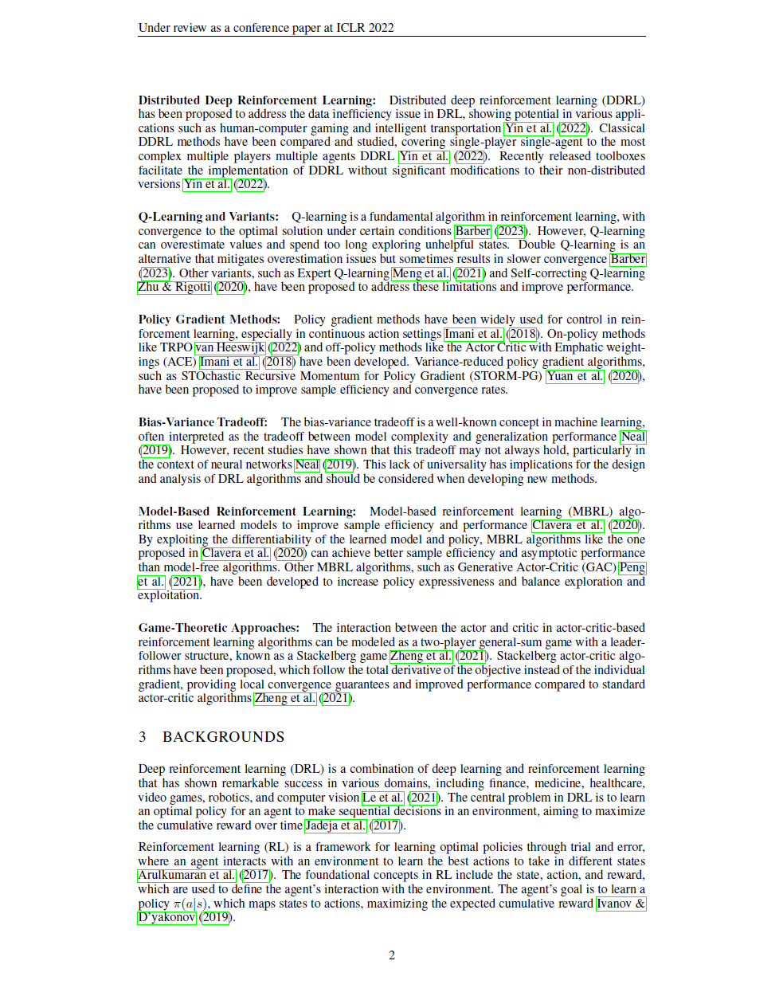

# Auto-Draft: 文献整理辅助工具

这个项目旨在辅助AI领域学术论文的文献整理。提供如下功能：
* 主题归纳： 自动搜索相关文献，总结相关工作。
* 真实引用：所有引用的文献都有对应原文，避免AI胡说八道。
* 生成LaTeX模板： 输出结果一键编译。  

运行过程需要能使用GPT-4的API Key. 生成一篇论文需要15000 Tokens(大约0.5到0.8美元). 总共过程需要大约十分钟. 

# 体验地址  
以下链接提供简单功能的免费体验. 如果需要更定制化的功能, 请参照*使用方法*进行本地部署和自行修改.

https://huggingface.co/spaces/auto-academic/auto-draft

# 使用方法 
1. 克隆此仓库：
```angular2html
git clone https://github.com/CCCBora/auto-draft
```
2. 安装依赖：
```angular2html
pip install -r requirements.txt
```
3. 在环境变量中设定OPENAI_API_KEY。
4. 编辑`auto_backgrounds.py`以自定义想要探索的主题和描述，然后运行
```angular2html
python auto_backgrounds.py
```

# 示例
`outputs` 文件夹中提供了部分输入的原始输出. 经由Overleaf直接编译得到. 也可以查看本目录下的sample-output.pdf.

Page 1            |  Page 2
:-------------------------:|:-------------------------:
 |   

# License
This project is licensed under the MIT License. 
Some parts of the code are under different licenses, as listed below:

* `latex-flatten.py`: Licensed under the Unlicense. Original source: [rekka/latex-flatten](https://github.com/rekka/latex-flatten).
