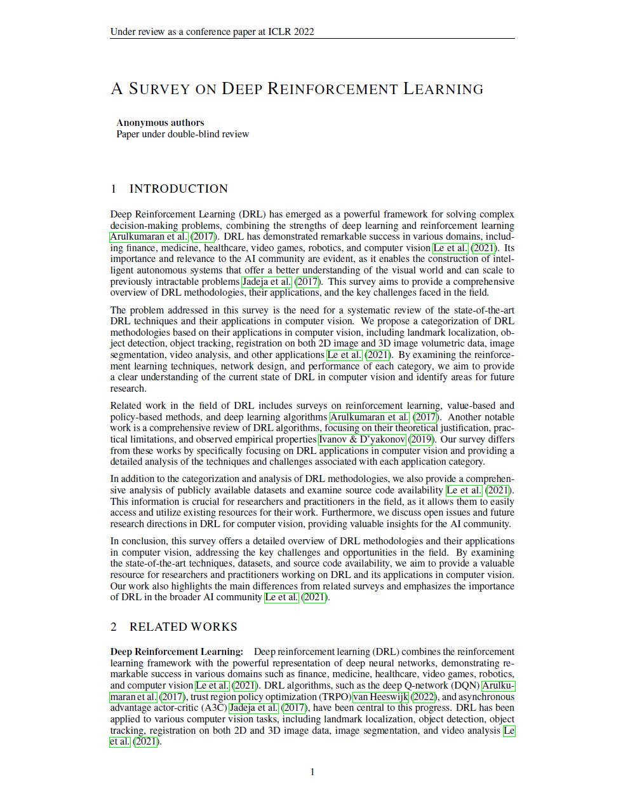

# Auto-Draft: 文献整理辅助工具

这个项目旨在轻松快捷的生成学术论文! 帮助你解决下面的问题:
* 自动搜索相关文献, 提供真实有出处的引用.
* 自动生成LaTeX模板, 为图表和算法预留出位置. 只需要在对应位置填入内容就能得到完整论文. 

# Huggingface Space  
项目对硬件要求低. 在Huggingface Space上即可流畅运行：

https://huggingface.co/spaces/auto-academic/auto-draft

# 部署方法 
1. 克隆此仓库：
```angular2html
git clone https://github.com/CCCBora/auto-draft
```
2. 安装依赖：
```angular2html
pip install -r requirements.txt
```
3. 在环境变量中设定OPENAI_API_KEY. 
4. 编辑`auto_backgrounds.py`以自定义论文标题, 然后运行
```angular2html
python auto_backgrounds.py
```

# 修改Prompts
如果希望对生成内容有更多的控制, 可以修改`prompts/instructions.json`中对每个章节的指导. 

# 示例
`outputs` 文件夹中提供了部分输入的原始输出. 经由Overleaf直接编译得到. 也可以查看本目录下的`Playing_Atari_with_Deep_Reinforcement_Learning.pdf`.

Page 1            |  Page 2
:-------------------------:|:-------------------------:
 |   

# License
This project is licensed under the MIT License. 
Some parts of the code are under different licenses, as listed below:

* `latex-flatten.py`: Licensed under the Unlicense. Original source: [rekka/latex-flatten](https://github.com/rekka/latex-flatten).
